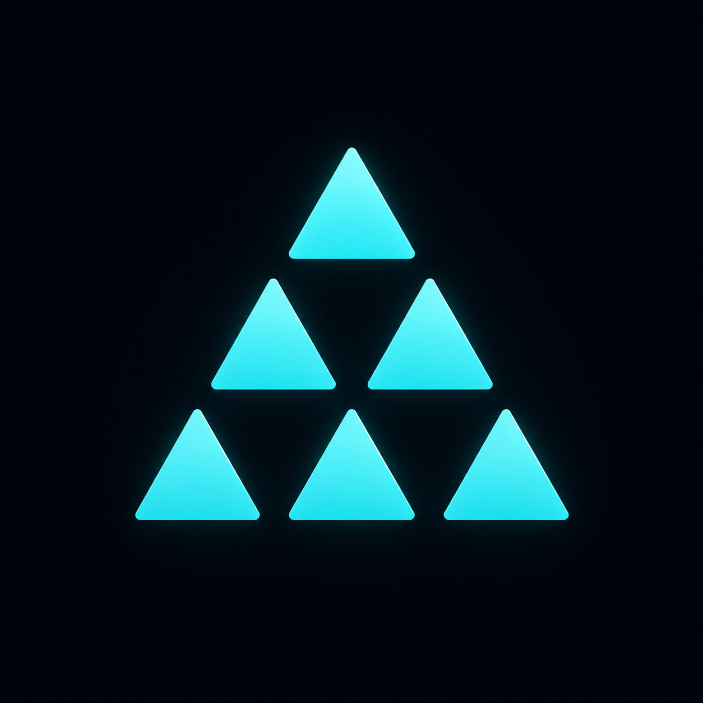

# Atlas




**Documentation:** [https://atlas-system-suite.github.io/Atlas/](https://atlas-system-suite.github.io/Atlas/)
> **Atlas introduces a universal execution model for software through Workers.**

Atlas is a software platform that sits precisely between programming languages and user managers. Where programming languages express computation, Atlas expresses software architecture.

---

## Why Atlas Exists

Large applications inevitably become difficult to manage because:
- Everything becomes tightly coupled.
- Plugin systems are bolted on as afterthoughts and lack consistency.
- Testing in isolation becomes nearly impossible.
- Components aren't easily reusable across different managers.
- Communication between features becomes ad-hoc and untrackable.

Atlas solves this by introducing **Workers** and **Models**. By forcing all executable code into strictly bound Workers, Atlas guarantees absolute modularity.

---

## Philosophy

* **Workers own.** (They own state, persistence, and execution).
* **Atlas coordinates.** (It handles discovery, lifecycle, and session binding).
* **Models define.** (They provide declarative, tool-independent specifications).
* **Roles describe.** (They tag Workers for tooling, without changing runtime behavior).
* **Tooling teaches.** (Solon enforces the architecture).

---

## Core Concepts

- **Worker:** The ONLY executable primitive in Atlas. Owns business logic and state.
- **Room:** An execution context representing a collaboration between Workers. Rooms are stewarded by Atlas.
- **Session:** The communication primitive connecting Workers. Exists inside Rooms.
- **Binding:** A negotiated connection established by Atlas between a requesting Worker and a providing Worker.
- **Invocation:** The actual execution request sent over a Session and processed by a Worker.
- **Model:** The declarative, tool-independent blueprint that a Worker implements.
- **Role:** A metadata tag (e.g., `database`, `manager`, `ai`) that describes a Worker to the Studio Suite.
- **Registry:** Stores runtime facts. Split into the **Global Registry** (macro-state) and **Room Registry** (execution cache).
- **Communication:** Workers communicate by sending Headers. Atlas handles the Transport and Translation layers to guarantee language neutrality.

---

## Architecture

```text
Programming Language
         ↓
   Atlas Runtime
         ↓
      Workers
         ↓
      Managers
```

---

## Atlas Studio Suite

The Studio Suite is the official developer toolkit for the Atlas ecosystem. 

### Atlas Studio
The visual authoring environment and workspace manager for the Atlas ecosystem. Features a drag-and-drop Topology Designer to wire up Workers without code, an Integrated Marketplace for 1-click capabilities, and cross-language toolchain orchestration.

### Miron
The runtime console. Equivalent to Task Manager + Docker Desktop + Runtime Inspector. Used to inspect running Workers, monitor communication, view the Registry, and manage topology.

### Solon
The build system and validator. Solon consumes Models to generate tests, SDKs, documentation, and mocks. It validates architecture without needing to boot the Runtime.

### Varsity
The learning platform. Provides project scaffolding, interactive tutorials, project review, and acts as an architecture mentor recommending best practices.

---

## Why Atlas is Different

Atlas combines proven ideas from distinct domains into one coherent platform:
- **Microkernels:** The Runtime is kept incredibly small, delegating everything to Workers.
- **Contract-First Development:** Models define communication completely independently of implementation.
- **Plugin Systems & Component Systems:** Behavior is defined by composition.
- **Tool-Driven Architecture:** The ecosystem relies heavily on Solon to validate and scaffold.

---

## Roadmap

```text
Architecture
      ↓
   Runtime
      ↓
 Studio Suite
      ↓
 Marketplace
      ↓
Multi-language Runtime
```
