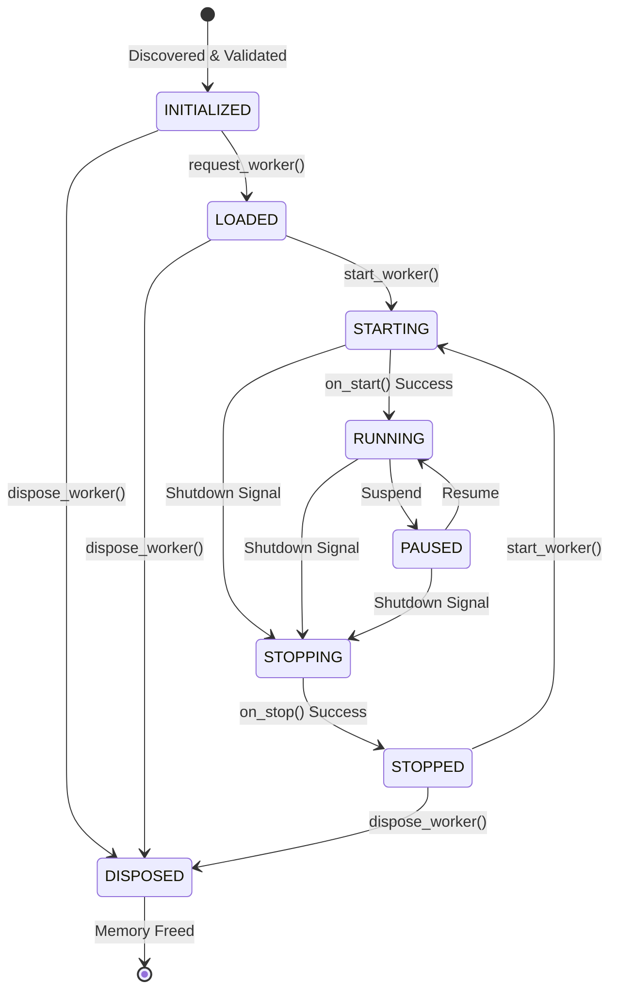

# Worker Lifecycle State Machine

The Worker Manager enforces a strict state machine to guarantee safety and thread concurrency. 

Every Worker traverses these states:

### Safety and Concurrency
Attempting to jump states illegally (e.g., `LOADED` directly to `PAUSED`) returns a `Result.err(IllegalStateTransitionError)` and prevents execution.

Because each `ManagedWorker` holds its own fine-grained lock, State transitions occur in parallel across the system. 
Worker A moving to `RUNNING` never blocks Worker B moving to `STOPPED`.
