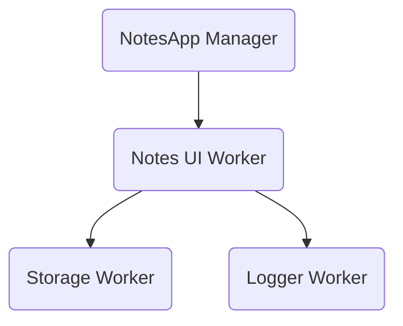

  Course Overview
  <h1 class="atlas-chapter-title">The Atlas Journey</h1>
  
A narrative-driven masterclass. Build a complete, distributed application from scratch and learn the architectural philosophy by doing.

This track is designed for developers who **learn by doing**. Instead of reading abstract theory, we are going to build a practical application.

By the end of this journey, you will have built an intelligent **Notes Application** that features:
- A custom Worker to process text.
- A Storage Worker to persist data to disk.
- A central Manager to orchestrate the system.

  
The Two Tracks of Atlas

  
Atlas provides two distinct ways to learn:

  <ol>
    <li><strong>The Journey (You are here)</strong>: A continuous, narrative-driven tutorial. We will build a project step-by-step.</li>
    <li><strong><a href="../compendium/manifests.md">The Compendium</a></strong>: The exhaustive reference manuals. If you ever wonder <em>"What does the `cost` field do in the adapter manifest?"</em>, the Compendium has the answer.</li>
  </ol>

## What We Are Building

We are going to build a simple `NotesApp`. Here is how the Capability Graph will look when we are finished:

Let's begin.

 
<strong><a href="01-scaffolding/" style="color: var(--atlas-red); text-decoration: none; border-bottom: 1px solid var(--atlas-red); padding-bottom: 2px;">Next Chapter: Scaffolding & CLI &rarr;</a></strong>

