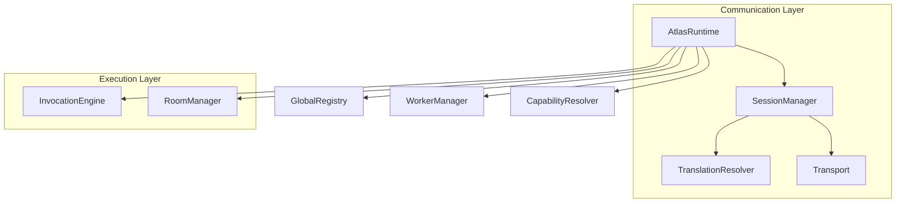

# Phase 1: Runtime Core (Orchestrator)

The Runtime Core (`AtlasRuntime`) represents the completion of Atlas Runtime v1. It serves as the supreme orchestrator for all underlying execution primitives (Registry, Workers, Translators, Transport, Sessions, Invocations, and Rooms).

The Core is highly opinionated about lifecycle, but completely agnostic to business logic. It owns none.

## Boot Sequence
Atlas strictly enforces deterministic initialization. If any subsystem fails to boot, Atlas fails fast and enters a `FAILED` state. Partial booting is explicitly disallowed.
1. `GlobalRegistry`
2. `WorkerManager`
3. `CapabilityResolver` & `ExecutionPlanner`
4. `Transport` & `TranslationResolver`
5. `SessionManager`
6. `InvocationEngine`
7. `RoomManager`

## Graceful Shutdown
Atlas guarantees no state is orphaned. During `shutdown()`, the Core cascades tear-down signals in the correct dependency order:
1. Rejects new Sessions / Invocations (Scheduler halt).
2. Drains & destroys all `Rooms`.
3. Closes all `Sessions`.
4. Shuts down the `Transport` channel.
5. Flushes the `Registry`.
6. Enters `SHUTDOWN` state safely.

## Public Runtime API
The `AtlasRuntime` object is the single integration point for Atlas Studio, Miron, or any external harness. It deliberately hides the mutative APIs of the subsystems (e.g. `RoomSteward`, `ExecutionPlanner`) and only exposes safe, read-only accessor facades to protect structural integrity.

### Architecture

