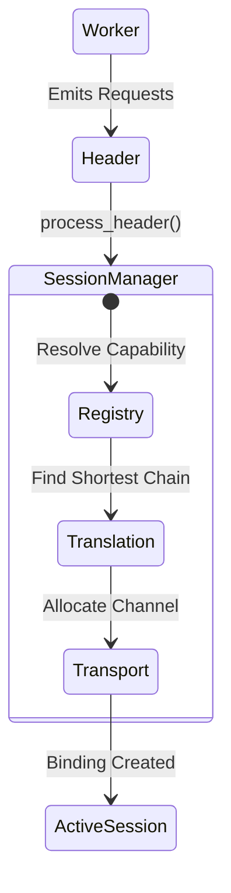

# Phase 1: Session Manager

The Session Manager acts as the universal communication primitive in Atlas. It serves as the orchestrator that sits between Workers, utilizing the **Transport Layer** (to move bytes) and the **Translation Resolver** (to convert formats), wrapping them into a managed, lifecycle-aware `Session`.

## Responsibilities
- Provide a thread-safe `SessionRegistry` for all capability bindings.
- Expose the Header Protocol so workers can request dependencies en masse.
- Negotiate and establish connections without relying on internal business logic.
- Maintain a strict state machine lifecycle for connections.

## The Header Protocol
Before a Session is established, a Worker emits a `CommunicationHeader`. Atlas resolves the entire Header before constructing the active Sessions.
```python
header = CommunicationHeader(
    source_worker_id="DashboardWorker",
    requests=[
        HeaderRequest(capability="database", optional=False),
        HeaderRequest(capability="telemetry", optional=True)
    ]
)
```

## Session Negotiation Algorithm
When `process_header(header)` is called:
1. **Capability Matching:** Atlas finds the best target worker for the requested capabilities via the `GlobalRegistry`.
2. **Translation Negotiation:** Atlas asks the `TranslationResolver` to find the shortest compatible translation chain between the source and target formats.
3. **Transport Allocation:** Atlas allocates a new `channel_id` on the `TransportStrategy` and binds it to the Session.
4. **Binding Record:** A `Binding` is created and stored in the `SessionRegistry`.
5. **Lifecycle Progression:** The Session transitions from `CREATED` -> `NEGOTIATING` -> `ESTABLISHED` -> `ACTIVE`.

## Session Lifecycle State Machine
Every Session enforces strict state transitions. Illegal transitions will immediately raise a `SessionStateError` (Severity: RECOVERABLE).

`CREATED -> NEGOTIATING -> ESTABLISHED -> ACTIVE -> IDLE -> SUSPENDED -> CLOSING -> DESTROYED`

### Architecture


